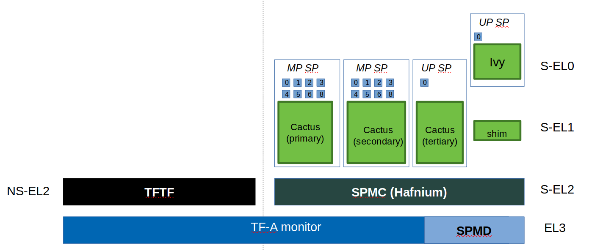

Building TF-A Tests
===================

-  Before building TF-A Tests, the environment variable ``CROSS_COMPILE`` must
   point to the cross compiler.

   For AArch64:

   ::

       export CROSS_COMPILE=<path-to-aarch64-gcc>/bin/aarch64-none-elf-

   For AArch32:

   ::

       export CROSS_COMPILE=<path-to-aarch32-gcc>/bin/arm-eabi-

-  Change to the root directory of the TF-A Tests source tree and build.

   For AArch64:

   ::

       make PLAT=<platform>

   For AArch32:

   ::

       make PLAT=<platform> ARCH=aarch32

   Notes:

   -  If ``PLAT`` is not specified, ``fvp`` is assumed by default. See the
      `TF-A documentation`_ for more information on available build
      options.

   -  By default this produces a release version of the build. To produce a
      debug version instead, build the code with ``DEBUG=1``.

   -  The build process creates products in a ``build/`` directory tree,
      building the objects and binaries for each test image in separate
      sub-directories. The following binary files are created from the
      corresponding ELF files:

      -  ``build/<platform>/<build-type>/tftf.bin``
      -  ``build/<platform>/<build-type>/ns_bl1u.bin``
      -  ``build/<platform>/<build-type>/ns_bl2u.bin``
      -  ``build/<platform>/<build-type>/el3_payload.bin``
      -  ``build/<platform>/<build-type>/cactus_mm.bin``
      -  ``build/<platform>/<build-type>/cactus.bin``
      -  ``build/<platform>/<build-type>/ivy.bin``
      -  ``build/<platform>/<build-type>/quark.bin``

      where ``<platform>`` is the name of the chosen platform and ``<build-type>``
      is either ``debug`` or ``release``. The actual number of images might differ
      depending on the platform.

      Refer to the sections below for more information about each image.

-  Build products for a specific build variant can be removed using:

   ::

       make DEBUG=<D> PLAT=<platform> clean

   ... where ``<D>`` is ``0`` or ``1``, as specified when building.

   The build tree can be removed completely using:

   ::

       make realclean

-  Use the following command to list all supported build commands:

   ::

       make help

TFTF test image
```````````````

``tftf.bin`` is the main test image to exercise the TF-A features. The other
test images provided in this repository are optional dependencies that TFTF
needs to test some specific features.

``tftf.bin`` may be built independently of the other test images using the
following command:

::

   make PLAT=<platform> tftf

In TF-A boot flow, ``tftf.bin`` replaces the ``BL33`` image and should be
injected in the FIP image. This might be achieved by running the following
command from the TF-A root directory:

::

    BL33=<path/to/tftf.bin> make PLAT=<platform> fip

Please refer to the `TF-A documentation`_ for further details.

Realm payload test image
````````````````````````

``realm.bin`` is the realm payload test image and is packaged along with
tftf for Realm Management Extension (RME) testing. This can be built using
the following command:

::

    make PLAT=<platform> realm

The generated ``realm.bin`` needs to be packaged as part of ``tftf.bin`` to
be used as a single BL33 image and can be done using the following command:

::

    make PLAT=<platform> pack_realm

Please refer to the `TF-A RME documentation`_ for build and run instructions.

NS_BL1U and NS_BL2U test images
```````````````````````````````

``ns_bl1u.bin`` and ``ns_bl2u.bin`` are test images that exercise the *Firmware
Update (FWU)* feature of TF-A [#]_. Throughout this document, they will be
referred as the *FWU test images*.

In addition to updating the firmware, the FWU test images also embed some tests
that exercise the FWU state machine implemented in the TF-A. They send valid
and invalid SMC requests to the TF-A BL1 image in order to test its robustness.

NS_BL1U test image
''''''''''''''''''

The ``NS_BL1U`` image acts as the `Application Processor (AP) Firmware Update
Boot ROM`. This typically is the first software agent executing on the AP in the
Normal World during a firmware update operation. Its primary purpose is to load
subsequent firmware update images from an external interface, such as NOR Flash,
and communicate with ``BL1`` to authenticate those images.

The ``NS_BL1U`` test image provided in this repository performs the following
tasks:

-  Load FWU images from external non-volatile storage (typically flash memory)
   to Non-Secure RAM.

-  Request TF-A BL1 to copy these images in Secure RAM and authenticate them.

-  Jump to ``NS_BL2U`` which carries out the next steps in the firmware update
   process.

This image may be built independently of the other test images using the
following command:

::

   make PLAT=<platform> ns_bl1u

NS_BL2U test image
''''''''''''''''''

The ``NS_BL2U`` image acts as the `AP Firmware Updater`. Its primary
responsibility is to load a new set of firmware images from an external
interface and write them into non-volatile storage.

The ``NS_BL2U`` test image provided in this repository overrides the original
FIP image stored in flash with the backup FIP image (see below).

This image may be built independently of the other test images using the
following command:

::

   make PLAT=<platform> ns_bl2u

.. _build_putting_together:

Putting it all together
'''''''''''''''''''''''

The FWU test images should be used in conjunction with the TFTF image, as the
latter initiates the FWU process by corrupting the FIP image and resetting the
target. Once the FWU process is complete, TFTF takes over again and checks that
the firmware was successfully updated.

To sum up, 3 images must be built out of the TF-A Tests repository in order to
test the TF-A Firmware Update feature:

-  ``ns_bl1u.bin``
-  ``ns_bl2u.bin``
-  ``tftf.bin``

Once that's done, they must be combined in the right way.

-  ``ns_bl1u.bin`` is a standalone image and does not require any further
   processing.

-  ``ns_bl2u.bin`` must be injected into the ``FWU_FIP`` image. This might be
   achieved by setting ``NS_BL2U=ns_bl2u.bin`` when building the ``FWU_FIP``
   image out of the TF-A repository. Please refer to the section Building FIP
   images with support for Trusted Board Boot in the `TF-A documentation`_.

-  ``tftf.bin`` must be injected in the standard FIP image, as explained
   in section `TFTF test image`_.

Additionally, on Juno platform, the FWU FIP must contain a ``SCP_BL2U`` image.
This image can simply be a copy of the standard ``SCP_BL2`` image if no specific
firmware update operations need to be carried on the SCP side.

Finally, the backup FIP image must be created. This can simply be a copy of the
standard FIP image, which means that the Firmware Update process will restore
the original, uncorrupted FIP image.

EL3 test payload
````````````````

``el3_payload.bin`` is a test image exercising the alternative EL3 payload boot
flow in TF-A. Refer to the `EL3 test payload README file`_ for more details
about its behaviour and how to build and run it.

SPM test images
```````````````

This repository contains three sample Secure Partitions (SP) meant to be used
with one implementation of a Secure Partition Manager (SPM):

- Cactus-MM
- Cactus and Ivy

They are only supported on AArch64 FVP. They can be built independently of the
other test images using the following command:

::

   make PLAT=fvp cactus ivy cactus_mm

To run the full set of tests in the Secure Partitions, they should be used in
conjunction with the TFTF image.

Please refer to the `TF-A documentation`_ for further details.

Cactus-MM
'''''''''

Cactus-MM is designed to test the TF-A EL3 SPM implementation
(`TF-A Secure Partition Manager (MM)`_) based on the
`Arm Management Mode Interface`_ (MM)

This SP runs in Secure-EL0 and performs the following tasks:

-  Test that TF-A has correctly setup the secure partition environment: it
   should be allowed to perform cache maintenance operations, access floating
   point registers, etc.

-  Test that TF-A accepts to change data access permissions and instruction
   permissions on behalf of the Secure Partition for memory regions the latter
   owns.

-  Test communication with SPM through MM interface.

In the TF-A boot flow, the partition replaces the ``BL32`` image and should be
injected in the FIP image. To test SPM-MM with Cactus-MM, it is enough to use
``cactus_mm.bin`` as BL32 image.

For SPM-MM, build TF-A following `Building TF-A Secure Partition Manager (MM)`_ and the following
commands can be used to build the tests:

::

    # TF-A-Tests repository:

    make PLAT=fvp TESTS=spm-mm tftf cactus_mm

Cactus and Ivy
''''''''''''''

Cactus and Ivy are designed to test the FF-A based SPM implementation with
secure virtualization enabled. Refer to `Arm Firmware Framework for Armv8-A`_

In the TF-A reference code base, BL31 implements the SPMD and BL32 the SPMC.
The SPMC runs at S-EL2 and acts as a partition manager for multiple secure
partitions (`TF-A Secure Partition Manager (FF-A)`_):

- Cactus is a sample FF-A compliant S-EL1 partition. As a matter of providing
  a realistic test harness, three instances of the same partition binary are
  launched as separate SPs (hence assigned three different FF-A IDs
  corresponding each to a different secure partition). Each secure partition
  instance has a separate manifest (`Cactus sample manifest`_,
  `Cactus secondary manifest`_, `Cactus tertiary manifest`_ ). First two
  instances are MP SPs. Third instance is a UP SP. Each instance runs a set
  of built-in tests at boot time. They exercise SP to SPMC FF-A interfaces
  contained in the secure world. The partition interacts with the SPMC through
  SMC. Once the NWd and TFTF are started, another set of run-time tests
  exercise the normal world to secure world primitives.
- Ivy is a specific kind of S-EL1 UP partition, where the S-EL1 exception level
  consists of a thin shim layer. The applicative part of the partition is held
  at S-EL0. The shim provides early bootstrap code, MMU configuration and a
  vector table trapping S-EL0 requests. The application interacts with the shim
  through FF-A protocol by the use of SVC instruction. The shim relays the
  request to the SPMC by an SMC. The S-EL0 application doesn't require knowledge
  of the shim, and can be self contained.

This picture illustrates the test setup:



To build TFTF with SPM tests, Cactus and Ivy use:

::

    # TF-A-Tests repository:

    make PLAT=fvp TESTS=spm tftf cactus ivy

--------------

.. [#] Therefore, the Trusted Board Boot feature must be enabled in TF-A for
       the FWU test images to work. Please refer the `TF-A documentation`_ for
       further details.

--------------

*Copyright (c) 2019-2021, Arm Limited. All rights reserved.*

.. _EL3 test payload README file: https://git.trustedfirmware.org/TF-A/tf-a-tests.git/tree/el3_payload/README
.. _Arm Management Mode Interface: https://developer.arm.com/documentation/den0060/a/
.. _Arm Firmware Framework for Armv8-A: https://developer.arm.com/docs/den0077/latest
.. _TF-A documentation: https://trustedfirmware-a.readthedocs.org
.. _TF-A RME documentation: https://trustedfirmware-a.readthedocs.io/en/latest/components/realm-management-extension.html
.. _TF-A Secure Partition Manager (FF-A): https://trustedfirmware-a.readthedocs.io/en/latest/components/secure-partition-manager.html
.. _TF-A Secure Partition Manager (MM): https://trustedfirmware-a.readthedocs.io/en/latest/components/secure-partition-manager-mm.html
.. _Building TF-A Secure Partition Manager (MM): https://trustedfirmware-a.readthedocs.io/en/latest/components/secure-partition-manager-mm.html#building-tf-a-with-secure-partition-support
.. _Cactus sample manifest: https://git.trustedfirmware.org/TF-A/tf-a-tests.git/tree/spm/cactus/plat/arm/fvp/fdts/cactus.dts?h=v2.5-rc1
.. _Cactus secondary manifest: https://git.trustedfirmware.org/TF-A/tf-a-tests.git/tree/spm/cactus/plat/arm/fvp/fdts/cactus-secondary.dts?h=v2.5-rc1
.. _Cactus tertiary manifest: https://git.trustedfirmware.org/TF-A/tf-a-tests.git/tree/spm/cactus/plat/arm/fvp/fdts/cactus-tertiary.dts?h=v2.5-rc1
